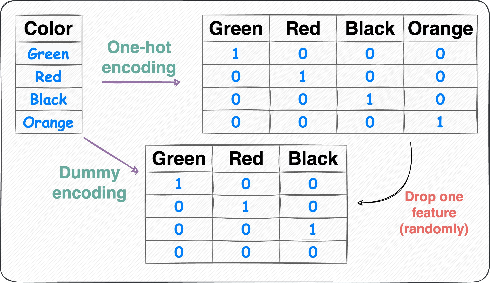

# Prediction Model through Dummies Variable Vs. OneHotEncoding
Based on the given data file 'carprices.csv' this code deals with the model training and prediction using two methods. 

1. By using Pandas, dummy variables 
2. By using Sklearn, OneHotEncoder 

## Installation 

Use the package manager [pip](https://pip.pypa.io/en/stable/) to install Pandas and Sklearn

```bash
pip install pandas
pip install sklearn
```


Image source: Daily Dose of Datascience